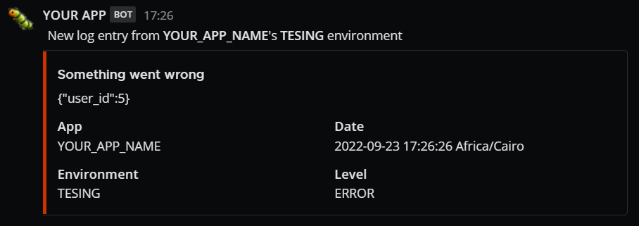

# Laramost

Laramost is a [Monolog](https://github.com/Seldaek/monolog) handler channel for Laravel that allows you to send log records to a mattermost channel.

## Installation

```shell
$ composer require muhamadhhassan/laramost
```

## Levels

Monolog levels are used to set the message color and icon

| Level Name | Level Value | Color   | Emoji                |
|------------|-------------|---------|----------------------|
| DEBUG      | 100         | #91C4EB | :mag:                |
| INFO       | 200         | #91C4EB | :information_source: |
| NOTICE     | 250         | #99cc33 | :memo:               |
| WARNING    | 300         | #ffcc00 | :warning:            |
| ERROR      | 400         | #cc3300 | :bug:                |
| CRITICAL   | 500         | #cc3300 | :x:                  |
| EMERGENCY  | 600         | #cc3300 | :rotating_light:     |

## Usage

### In Laravel Apps

In your `config/logging.php` add the `mattermost` channel to the `channels` array:

```php
use LaraMost\Formatter\MattermostFormatter;
use LaraMost\Handler\MattermostWebhookHandler;

'channels' => [
    'mattermost' => [
        'driver'  => 'monolog',
        'handler' => MattermostWebhookHandler::class,
        'formatter' => MattermostFormatter::class,
        'with' => [
            'hook' => 'https://your-mattermost.com/hooks/xxx-generatedkey-xxx',
        ],
        'level' => 'error'
    ],
],
```

Then simply, using Laravel `Log` facade:

```php
Log::channel('mattermost')->error('Something went wrong', ['user_id' => 5]);
```

### In any PHP Apps

```php
use Monolog\Logger;
use LaraMost\Formatter\MattermostFormatter;
use LaraMost\Handler\MattermostWebhookHandler;

$logger = new Logger('application');
$handler = new MattermostWebhookHandler('https://your-mattermost.com/hooks/xxx-generatedkey-xxx', Logger::ERROR);
$handler->setFormatter(new MattermostFormatter())
$logger->pushHandler($handler);

$logger->error('Something went wrong', ['user_id' => 5]);
```

Both Will send the following message to your mattermost channel:


> **Warning**: When you log to the `mattermost` channel make sure that the level is greater than or equals the one defined in `config/logging.php`
